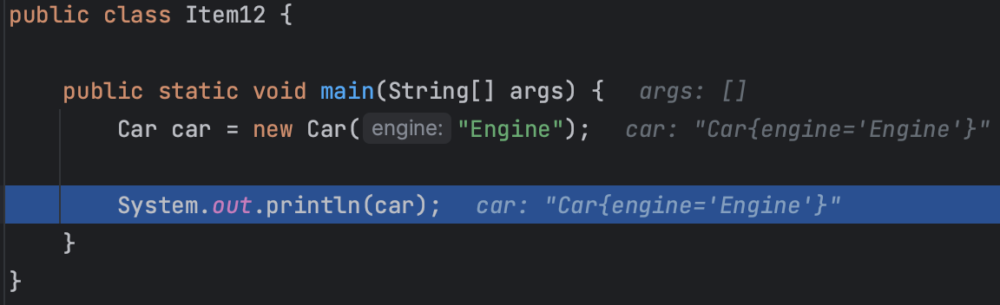
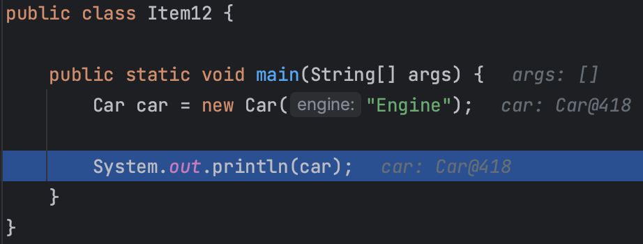

## toString을 재정의해야 하는 이유

1. 작성한 클래스의 적합한 문자열을 반환하지 않는다.
2. `Car@418` 와 같이 `클래스이름@16진수로표기한해시코드` 를 반환한다.
3. 객체의 핵심 필드를 알려주는 것이 유익한 형태이다.
4. toString을 잘 구현한 클래스는 사용하기에 훨씬 즐겁고, 디버깅에 용이하다.
5. toString은 직접 호출하지 않더라도 println, pringf, 문자열 연결 연산자(+), assert 구문, 디버거의 객체 출력에서 자동으로 호출된다.
6. map 객체의 경우 `{Jenny = PhoneNumber@addbb}`보다 `{Jenny = 012-1234-5678}`라는 메시지가 훨씬 가독성이 높다.

### toString을 재정의하지 않은 예시



### toString을 재정의한다면?



## 어떻게 재정의해야 하는가?

### 간결하면서 읽기 쉬운 형태의 유익한 정보를 담아야 한다.

```java
PhoneNumber@adbbd -> 012-1234-5678   
Car@442           -> Car{name=sun, position=2}
```

### 객체가 가진 주요 정보 모두를 반환하는게 좋다.

```java
class Address {
    private final String city;
    private final String gu;
    private final String dong;
    private final String detail;

    Address(String city, String gu, String dong, String detail) {
        this.city = city;
        this.gu = gu;
        this.dong = dong;
        this.detail = detail;
    }

    @Override
    public String toString() {
        return "Address{" +
                "city='" + city + '\'' +
                ", gu='" + gu + '\'' +
                '}';
    }
}
```

위처럼 일부 필드만을 반환하는 것은 좋은 방법이 아니다.

만약 객체가 거대하거나 객체의 상태가 문자열로 표현하기에 적합하지 않다면 요약정보를 담아야 한다.
`ex) 맨해튼 거주자 전화번호부(총 1487536개)`

### 반환값의 포맷을 문서화할지 정해야 한다.

전화번호나 행렬 같은 값 클래스라면 문서화하기를 권한다.

포맷을 명시하면 그 객체는 표준적이고, 명확하고, 사람이 읽을 수 있게 된다.

```java
public String toString() {
    return String.format("%03d-%03d-%04d", areaCode, prefix, lineNumber);
}

// 포맷 적용 전,
PhoneNumber{areaCode='02', prefix='512', lineNumber='1234'}

// 포맷 적용 후,
02-512-1234
```

포맷을 한 번 명시하면 평생 그 포맷에 얽매이게 된다. 프로그래머들이 그 포맷에 맞춰 코드를 작성할 것이라는 단점이 있다.

반대로 포맷을 명시하지 않는다면 향후 릴리스에서 정보를 더 넣거나 포맷을 개선할 수 있는 유연성을 얻게 된다.

**포맷 명시 여부와 상관없이 toString이 반환한 값에 포함된 정보를 얻어올 수 있는 API를 제공해야 한다.**

접근자를 제공하지 않으면 이 정보가 필요한 프로그래머는 toString의 반환값을 파싱해야 하는데, 이는 성능을 떨어뜨림과 동시에 불필요한 작업이고, 향후 포맷을 바꾸면 시스템이 망가지는 결과를 초래할 수 있다.

### 의도는 항상 명확히 밝혀야 한다.

주석을 통해 어떤 형태로 문자열을 반환하는지 명시해야 한다.

```java
/**
 * 이 전화번호의 문자열 표현을 반환한다.
 * 이 문자열은 "XXX-YYY-ZZZZ" 형태의 12글자로 구성된다.
 * XXX는 지역코드, YYY는 프리픽스, ZZZZ는 가입자 번호다.
 * 각각의 대문자는 10진수 숫자 하나를 나타낸다.
 * 
 * 전화번호의 각 부분의 값이 너무 작아서 자릿수를 채울 수 없다면,
 * 앞에서부터 0으로 채워나간다. 예컨대 가입자 번호가 123이라면
 * 전화번호의 마지막 네 문자는 "0123"이 된다.
 */
public String toString() {
    return String.format("%03d-%03d-%04d", areaCode, prefix, lineNumber);
}
```

## toString을 재정의하지 않아도 되는 경우

- 정적 유틸리티 클래스
- 대부분의 열거 타입 (Enum)

## 결론

모든 구체 클래스에서 Object의 toString을 재정의하자.

포맷까지는 하지 않더라도 객체의 값에 관해 아무것도 알려주지 않는 Object의 toString보다는 IDE의 자동 생성 기능을 사용하는 것이 좋다.

상위 클래스에서 이미 알맞게 재정의한 경우는 예외이다.

toString은 해당 객체에 관한 명확하고 유용한 정보를 읽기 좋은 형태로 반환해야 한다.