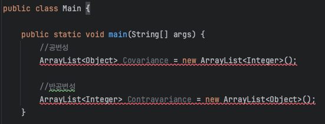
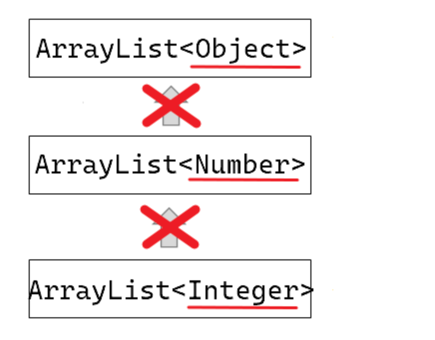
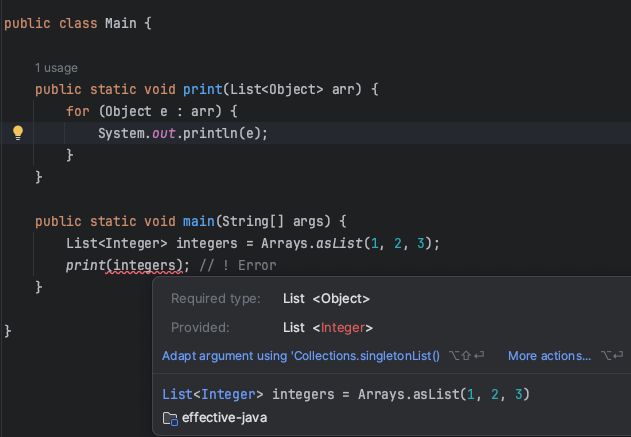

## 로 타입은 사용하지 말자 - 아이템 26

## 제네릭 타입이란?
클래스와 인터페이스 선언에 타입 매개변수(Type Paramter)가 사용되면, 이를 `제네릭 클래스 혹은 제네릭 인터페이스`라고 부르며 이를 통틀어 `제네릭 타입`이라고 한다.
<br>

각각의 제네릭 타입은 일련의 매개변수화 타입을 정의한다. 먼저 클래스의 이름이 나오고, 바로 옆에 꺾쇠괄호 안에 실제 타입 매개변수들을 나열한다.

예를 들면, `List<String>`은 원소의 타입이 String인 리스트를 뜻하는 매개변수화 타입이다. 여기서 `String`이 정규 타입 매개변수 `E`에 해당하는 실제 타입 매개변수이다.
<br>

그리고, 제네릭 타입을 하나 정의하면 그에 딸린 `로 타입`도 함께 정의된다. 이 `로 타입`이 바로 오늘 설명한 주제이다.

## 자바의 공변성/반공변성
### 배열은 공변성이 있다.
- 공변성(Covariance)은 서로 다른 타입간에 함께 번할수 있다는 특징을 말한다. 객체지향 개념으로 표현하자만 Liskov 치환 원칙에 해당한다.

```java
//공변성
Object[] Covariance = new Integer[10];

//반공변성
Integer[] Contravariance = (Integer[]) Covariance;
```
### 제네릭은 공변성이 없다.



반면에 자바의 제네릭은 무공변의 성질을 가진다. 왜냐하면 자바는 일반적으로 제네릭 타입에 대해서 공변성/반공변성을 지원하지 않기 때문이다.

### 재네릭 타입은 상하관계가 없다
상하관계가 있는 객체와 달리, 제네릭의 타입 파라미터(꺽쇠 괄호) 끼리는 아무리 상속 관계에 놓인다 한들 캐스팅이 불가능하다. 왜냐하면 제네릭은 무공변이기 때문이다.
<span style="color:red">제네릭은 전달받은 딱 그 타입으로만 서로 캐스팅이 가능하다.</span>


```java
ArrayList<Object> parent = new ArrayList<>();
ArrayList<Integer> child = new ArrayList<>();

parent = child;// ! 업캐스팅 불가능
child = parent;// ! 다운캐스팅 불가능
```

꺽쇠 괄호 부분을 제외한 원시 타입부분은 공변성이 적용되지만, 꺽쇠 괄호 안의 실제 타입 매개변수에 대해서는 적용되지 않는다고 정리할 수 있다.

### 공변성이 없으면 나타나는 문제점
이 특징이 왜 문제시 되나면, 매개변수로 제네릭을 사용할 떄, 외부에서 대입되는 인자의 캐스팅 문제로 인해 애로 사항이 발생하기 때문이다.

예를 들자면, 리스트를 인자로 받아 순회해서 출력해주는 print 메소드가 있다고 하자. 배열을 이용한 아래 코드는 문제가 없다.
#### 배열을 이용한 코드
```java
public static void print(Object[] arr) {
        for (Object e : arr) {
        System.out.println(e);
        }
        }

public static void main(String[] args) {
        Integer[] integers = {1, 2, 3};
        print(integers); // [1, 2, 3]
        }
```

#### 리스트의 제네릭을 이용한 코드
이번엔 배열이 아닌 리스트의 제네릭 객체로 넘겨보자. 그러면 메소드 호출 부분에서 컴파일 에러가 발생한다.


배열 같은 경우 print 메서드의 매개변수로 argument가 넘어갈 때 Integer[] 배열 타입이 Object[] 배열 타입으로 자연스럽게 업캐스팅이 적용되어 문제가 없다.
하지만 리스트 제네릭 같은 경우 타입 파라미터가 오로지 똑같은 타입만 받기 때문에 캐스팅이 되지 않아 그런 것이다.

그렇다면 외부에서 값을 받는 매개변수의 제네릭 타입 파라미터를 Integer로 고정된 타입으로 작성해줘야 하는데, 프로그램의 실행부에서 반드시 Integer 타입만 들어온다는 보장도 없으며,
만일 Double 형이나 아니면 상위 타입인 Number형과 같은 다른 타입의 값도 받고 싶은 경우, 메소드를 오버라이딩해서 즐비하게 코드를 작성해야 한다.

```java
public static void print(List<Integer> arr) {
}

public static void print(List<Double> arr) {
}

public static void print(List<Number> arr) {
}
```
그럼 제네릭은 자바의 특징이라고 할 수 있는 객체 지향을 전혀 이용하지 못하는 것인데, 결국 위와 같이 비효율적으로 코딩을 해야 하나?
아니다. 이를 해결하기 위해 나온 기능이 제네릭 <span style="color:red">와읻르 카드</span>인 것이다.

### 제네릭 와일드 카드
자바 제네릭을 이용해 프로그래밍을 할때 간혹 클래스 정의문을 보다가 꺾쇠 괄호 ? 물음표 기호가 있는 것을 한번쯤 본 적이 있을 것이다. 이 물음표가 **와일드카드**이며, 물음표의
의미 답게 어떤 타입이든 될 수 있다라는 뜻을 지니고 있다.
<br>
하지만 단순히 `<?>`로 사용하면 Object 타입과 다름이 없어지므로 보통 제네릭 타입 한정 연산사와 함께 쓰인다.
* 상한 경계 와일드 카드 `<? extends U>`
* 하한 경계 와일드 카드 `<? super U>`
### 로 타입이란?
<hr>

로 타입이란, 제네릭 타입에서 타입 매개변수를 전혀 사용하지 않을 때를 말한다. 코드로 설명하면 `List<E>`의 로 타입은 `List`이다.

로 타입은 타입선언에서 제네릭 타입 정보가 전부 지워진 것처럼 동작하는데, 제네릭 도입이 되기 전인 자바 1.4 버전 이하의 코드와 호환되도록 하기 위한 궁여지책이라고 할 수 있다.

제네릭 지원 전에는 컬렉션은 다음과 같이 선언했다.


<br>
해당 코드는 `Stamp` 타입만 저장을 하고 있다. 이때 루O 개발자가 실수로 `Coin`이라는 객체를 넣어버렸다. 과연 어떻게 될까??


<br>

아무 오류가 발생하지 않는다. 이대로 실행을 하고 해당 메서드를 호출하는 시점에 런타임에러`(ClassCastException)`가 발생하게 된다.

<br> 


즉, 오류가 발생하고 한참 뒤인 런타임에야 해당 오류를 발견할 수 있는데, 이렇게 되면 런타임에 문제를 겪는 코드와 원인을 제공한 코드가 물리적으로 떨어져 있을 가능성이 커지게 된다.

제네릭을 활용하면 이러한 문제를 해결할 수 있게 된다.


이렇게 선언하면 컴파일러는 stamps에는`Stamp` 인스턴스만 넣어야 함을 인지하게 된다. 이제 stamps에 엉뚱한 타입의 인스턴스를 넣으면 컴파일 오류가 발생하며 무엇이 잘못되었는지를 정확하게 알려준다.

즉, 정리하자면 로 타입을 사용하는 것을 자바 언어 차원에서 막아 놓지는 않았지만 사용하지 않는 것을 권장하며 그 이유는 앞선 코드에서 보았듯이 **로 타입 사용시 제네릭이 안겨주는 안정성과 표현력을 모두 잃게 되기 때문**으로 정리할 수 있다.

그럼 왜 이런 로 타입이 존재하는가에 대한 의문이 생기게 되는데 바로 `호환성 때문`이다. 자바 1.4 이하 버전에 작성된 코드와의 마이그레이션 호환성을 지켜주기 위해서 `타입 이레이저`라는 방식을 사용하여 호환성을 지켜주고 있다.
<br>

### 로 타입을 사용하고 싶을 경우에는?
두 개의 `Set`에 같은 원소가 몇 개 있는지 반환하는 메서드를 만든다고 한다면, 어떤 매개변수가 들어오든 상관이 없다. 따라서 로 타입을 사용해도 괜찮지 않을까 라는 생각을 할 수 있다.


하지만 로 타입은 역시 안전하지 않다. 그러면 이러한 경우 어떻게 해야할까??

`비한정적 와일드카드` 타입을 사용하면 된다. 비한정적 와일드카드 타입은 어떤 타입이라도 담을 수 있는 가장 범용적인 매개변수화 `Set` 타입이다.


그렇다면 로 타입과 비한정적 와일드카드 타입은 무슨 차이가 있는 것일까??

앞서 말했듯이, 로 타입에는 아무 원소나 넣을 수 있으니 타입 불변식을 훼손하기가 쉽다. 반면 비한정적 와일드카드는 `null`을 제외한 어떤 원소도 넣을 수 없다. 즉, 다른 원소를 넣으려 하면 컴파일할 때 에러를 발생하게 된다.

> 만약 비한정적 와일드카드의 제약을 제거하고 싶다면 제네릭 메서드(아이템 30), 한정적 와일드카드(아이템 31)을 사용하면 된다.
<br>
### 그럼에도 로 타입이 사용되는 곳이 있다면??
<hr>
로 타입을 쓰지 말라는 규칙에도 몇가지의 예외가 있다.

<br>

<u>첫번째 예외는 `class 리터럴`에는 로 타입을 사용해야 한다.</u>

자바 명세는 `class 리터럴`에 매개변수화 타입을 사용하지 못하게 했다.

여기서 `class 리터널`이란 `String.class`, `Integer.class` 등을 말하며 이를 하나의 객체로 생각하면 된다.

그러면 이들의 타입은, `String.class`의 타입은 `Class<String>`, `Integer.class`의 타입은 `Class<Integer>`로 볼 수 있으며 `Class<T>`가 로타입인 `Class`의 매개변수화 타입이라는 것을 우리는 확인할 수 있다.


<br>

위의 코드에서 보면 알 수 있듯이 자바 언어 자체에서 배열과 기본타입은 매개변수화 타입을 허용하지만 `List<String>.class` 타입은 지원해주지 않고 있는 것을 확인할 수 있다.

```text
허용 : List.class, String[] class, int class
혀용하지 않음 : List<Integer>.class, List<String>.class, List<?>.class
```


<u>두번째 예외는 `instanceof` 연산자 이다.</u>


런타임에는 제네릭 타입 정보가 지워지므로 instanceof 연산자는 로 타입이든 비한정적 와일드카드 타입이든 완전히 동일하게 동작하게 된다.


즉, `<?>` 은 코드의 가독성을 떨어트리게 되므로 차라리 `로 타입`을 사용하는 것이 좋을 수 있다.

<br>

### 최종 결론
* 제네릭은 컴파일 시점에 데이터 타입을 체크할 수 있으며, 잘못된 타입의 객체를 사용할 때 발생할 수 있는 오류를 사전에 방지한다. 이를 통해 런타임 오류를 줄이고, 프로그램의 안전성을 높인다.
* 로 타입은 제네릭이 도입되기 전 코드와의 호환성을 위해 제공될 뿐이다.
* 로 타입은 런타임에 예외가 발생할 수 있으니 되도록 사용을 하지 말도록 하자.

### 참고
- Effective Java / 조슈아 블로크 / Chapter 4 - item 26
- [Infa 블로그](https://inpa.tistory.com/entry/JAVA-%E2%98%95-%EC%A0%9C%EB%84%A4%EB%A6%AD-%EC%99%80%EC%9D%BC%EB%93%9C-%EC%B9%B4%EB%93%9C-extends-super-T-%EC%99%84%EB%B2%BD-%EC%9D%B4%ED%95%B4)
- 우아한테크 코스 2022-effective-java

