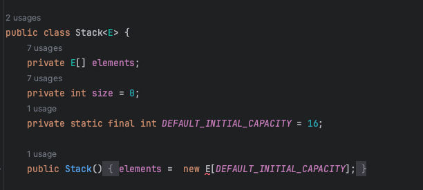

## 이왕이면 제네릭 타입으로 만들어라

### Object 기반 스택의 문제점은 뭘까?
```java
public class Stack {
    private Object[] elements;
    private int size = 0;
    private static final int DEFAULT_INITIAL_CAPACITY = 16;

    @SuppressWarnings("unchecked")
    public Stack() {
        elements = (E[]) new Object[DEFAULT_INITIAL_CAPACITY];
    }

    public void push(Object e) {
        ensureCapacity();
        elements[size++] = e;
    }

    public Object pop() {
        if (size == 0) {
            throw new EmptyStackException();
        }

        Object result = elements[--size];
        elements[size] = null;
        return result;
    }
}
```

```java
public class Main {

    public static void main(String[] args) {
        Stack stack = new Stack();
        stack.push(1);
        String item = (String) stack.pop();
        System.out.println(item);
    }
}
```
바로 클라이언트는 스택에서 꺼낸 객체를 형변환해야 하는데, 이때 런타임 에러가 날 수 있다는 점이다.(ClassCastException)

## Object를 제네릭으로 만들어보자


생성자에서 컴파일 에러가 발생한다.!!
### 왜 new E[]가 불가능할까?
**Generic은 실체화 할 수 없기 때문이다.**<br>
자바는 컴파일 시점에 E가 어떤 타입인지 알 수 없기 때문에, 런타임에 생성할 배열의 정확한 타입을 알 수 없기 때문이다.
new 키워드는 컴파일 시점에 실제 타입을 알아야 하는데, 제네릭 타입에서는 그 정보가 없기 때문에 new E[]와 같은 배열 생성이 불가능한 것이다.

    
#### 우회방법 1
- 배열을 Object로 생성하고 Generic으로 형 변환한다.
```java
public class Stack<E> {
    private E[] elements;
    private int size = 0;
    private static final int DEFAULT_INITIAL_CAPACITY = 16;

    @SuppressWarnings("unchecked")
    public Stack() {
        elements = (E[]) new Object[DEFAULT_INITIAL_CAPACITY];
    }
}
```

#### 우회방법 2
- elements의 타입을 Object[]로 바꾸고 pop에서 형변환을 한다.
```java
public class Stack<E> {
    private Object[] elements;
    private int size = 0;
    private static final int DEFAULT_INITIAL_CAPACITY = 16;

    public Stack() {
        elements = new Object[DEFAULT_INITIAL_CAPACITY];
    }

    public void push(E e) {
        ensureCapacity();
        elements[size++] = e;
    }

    public E pop() {
        if (size == 0) {
            throw new EmptyStackException();
        }

        @SuppressWarnings("unchecked")
        E result = (E) elements[--size];
        elements[size] = null;
        return result;
    }
}
```

### 1 방법과 2 벙법의 차이?
- 방법 1
    * 배열을 E[]로 선언하여 E타입만 받음을 명시해준다.!(타입 안전)
    * 하지만 런타임에는 E[]가 아닌 Object[]로 동작
    * 힙 오염의 가능성 존재(E가 Object가 아닌 한)
    * 형 변환을 생성자에서 배열 생성 시 한번만 해주면 된다.
- 방법 2
    * 애초에 Object[]배열이므로 힙 오염의 가능성 x
    * 그렇다면 pop 시 타입 보장?
        * push로 E만 들어오므로 Object[]에 저장되는 데이터가 모두 E타입임을 보장
    * 배열에서 원소를 읽을 때마다 타입 캐스팅을 해줘야 함...
---

### 힙 오염(Heap Pollution)이란?
* 매개변수 유형이 서로 다른 타입을 참조할 때 생가는 문제이다.
* 컴파일은 된다. 런타임에 ClassCastException을 발생시킬 뿐
```java
public class Main {

    public static void main(String[] args) {
        List<Integer> intList = new ArrayList<>();
        intList.add(1);
        
        Object object = intList;
        
        List<String> stringList = (ArrayList<String>) object;

        String data = stringList.get(0);
        System.out.println(data);
    }
}
```
위의 코드는 힙 오염에 대한 코드이다.
List<String>에서 String으로 꺼내니까 컴파일은 O<br>
하지만 실제 데이터는 int이므로 ClassCastException이 발생한다.
## 결론
클라이언트에서 직접 형변환해야 하는 타입보다 제네릭 타입이 더 안전하고 쓰기 편하다. 그러니 새로운 타입을 설계할 때는
형변환 없이도 사용할 수 있도록 해라.